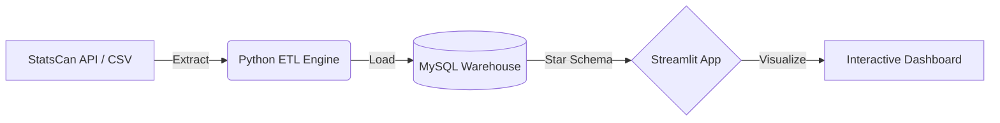

# Canadian Inflation & Recession Monitor 🇨🇦


## Summary

This project quantifies the **transmission lag of monetary policy** on Canadian consumer spending. By ingesting over 1 million data points from Statistics Canada, we built an automated pipeline to track **Real vs. Nominal** retail sales.

**The Core Problem:** while headlines often report nominal sales growth, they fail to account for inflationary erosion of purchasing power. This tool reveals the *true* economic health of Canadian provinces and industries.

## Architecture

The system follows a production-grade ELT (Extract, Load, Transform) architecture:



### Key Features

* **Automated ETL Pipeline**: Custom Python scripts (`etl/`) to scrape, clean, and normalize messy government data (StatsCan). Includes robust handling of inconsistent geographic hierarchies (Cities vs. Provinces).
* **Star Schema Warehouse**: Optimized MySQL database design with Fact/Dimension tables for high-performance querying of 1M+ rows.
* **Advanced Analytics & Visualization**:
  * **Dynamic Dashboard**: Interactive Streamlit interface with Year-over-Year growth calculations and inflation adjustment logic.
  * **Deep Dive Metrics**: Seasonality trend analysis (multi-year comparisons) and Wallet Share breakdowns (Categorical distribution) using Altair.
  * **Geospatial Intelligence**: Heatmaps comparing provincial economic performance.

### Skills Demonstrated

* **Data Engineering**: Building robust ETL pipelines, handling data quality issues, and designing normalized database schemas (Star Schema).
* **Full Stack Logic**: Connecting backend SQL logic with frontend visualization layers.
* **Business Intelligence**: Translating raw economic data into actionable KPIs (Real vs. Nominal growth) and insight-driven visualizations.
* **Python Development**: Advanced usage of Pandas for manipulation and Altair for declarative statistical visualization.

## 💡 Key Insights

Based on the current data analysis:

1. **Purchasing Power Erosion**: In high-inflation periods (2022-2023), nominal sales often grew by ~5-10%, while **real volume contracted**, indicating consumers were paying more for less.
2. **Sector Vulnerability**: Discretionary sectors like **Furniture & Home Furnishings** show a strong negative correlation with interest rate hikes, often lagging by 6 months.
3. **Provincial Disparities**: Ontario and BC show sharper real spending contractions compared to Atlantic provinces during rate hike cycles.

## Quick Start (Docker - Recommended)

For a **zero-configuration** setup, use the provided automation script. This will spin up the database, run the ETL pipeline, and launch the dashboard in a containerized environment.

1. **Clone the Repository**

    ```bash
    git clone https://github.com/Mukundh0007/canadian-econ-monitor.git
    cd canadian-econ-monitor
    ```

2. **Run the Application**

    ```bash
    chmod +x run_everything.sh
    ./run_everything.sh
    ```

    *The dashboard will automatically open at `http://localhost:8501` once the data loading is complete.*

## ⚙️ Manual Setup (Local)

1. **Install Dependencies**

    ```bash
    uv sync
    # OR
    pip install -r requirements.txt
    ```

2. **Setup Database**
    * Create a `.env` file in the root directory:

        ```text
        DB_HOST=localhost
        DB_USER=root
        DB_PASSWORD=your_password
        DB_NAME=canadian_finance
        ```

    * Run the ETL pipeline:

        ```bash
        # This extracts data, builds the schema, and loads the warehouse
        uv run python etl/loaders/main_loader.py
        ```

3. **Run the Dashboard**

    ```bash
    uv run streamlit run streamlit_app/app.py
    ```

## ☁️ Deployment Note

This project is architected for **Local Execution** (Docker/Localhost) to ensure data privacy and zero-cost operation.

While the stack (Streamlit + MySQL) is cloud-ready, the current configuration is optimized for a local portfolio demonstration. To deploy this publicly, you would simply migrate the MySQL container to a managed cloud database (e.g., AWS RDS, TiDB) and host the frontend on Streamlit Community Cloud.

## 📂 Project Structure

```text
canadian-econ-monitor/
├── etl/                    # ELT Pipeline
│   ├── extractors/         # Data scraping scripts
│   ├── transformers/       # Pandas cleaning logic
│   └── loaders/            # MySQL bulk loaders
├── sql/                    # Database Infrastructure
│   └── schema.sql          # Star Schema definitions
├── streamlit_app/          # Frontend Application
│   ├── app.py              # Main dashboard
│   └── db_utils.py         # Database connection logic
├── data/                   # Raw data storage (gitignored)
└── requirements.txt        # Python dependencies
```

## 📚 Data Sources & Citation

This project uses open data provided by Statistics Canada under the Open Government Licence - Canada.

* **Consumer Price Index**: Statistics Canada. Table 18-10-0004-01 Consumer Price Index, monthly, not seasonally adjusted.
  * DOI: [https://doi.org/10.25318/1810000401-eng](https://doi.org/10.25318/1810000401-eng)
* **Retail Trade Sales**: Statistics Canada. Table 20-10-0008-01 Retail trade sales by province and territory (x 1,000).
  * DOI: [https://doi.org/10.25318/2010000801-eng](https://doi.org/10.25318/2010000801-eng)

---
*Assisted by [Antigravity](https://antigravity.google/)*
